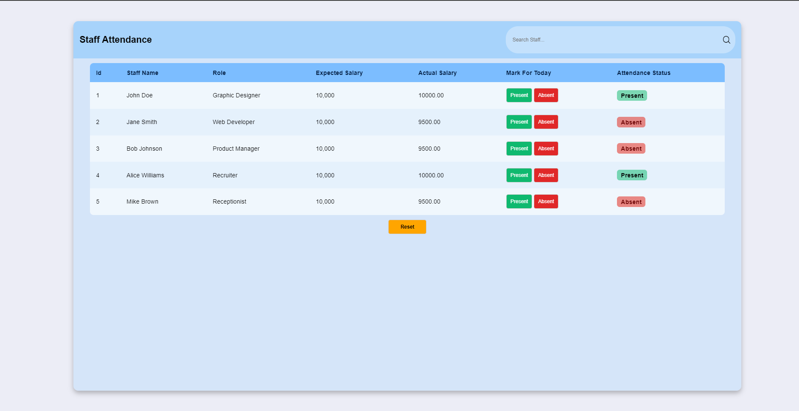

#  UX/UI/PHP Job Application Coding test
Code written by:
👨🏻‍⚕️ CollinsIkechukwu
## Introduction
This is a simple PHP/MySQL project designed to help HR staff set up staff attendance, mark staff as absent or present, and calculate their monthly pay based on their attendance.

## Requirements

- A web server with PHP installed
- A MySQL database

## Installation

1. Clone or download the project files to your web server
2. Create a new MySQL database and import the provided "staff.sql" file to create the "staff" table and add the example staff members
3. Update the database credentials in the "connection.php" file to match your MySQL database settings
4. Run the project on your web server

## Usage

- To mark a staff member as absent, click on "Absent"
- To mark a staff member as present, click on "Present"
- The system will automatically calculate each staff member's monthly pay based on their attendance and update the "Monthly Pay" column in the staff table
- After marking the attendance for a staff member, you will not be able to perform any attendance activity on that user
- The system calculates the number of working days dynamically depending on the month

## Conclusion

This Staff Attendance Management System is a simple but effective tool for HR staff to manage staff attendance and calculate monthly pay based on attendance. It can be easily customized and integrated into any existing HR management system.

